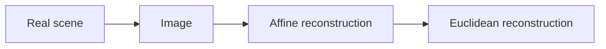

# iacv
Repository for the homework of Image Analysis and Computer Vision course of Politecnico di Milano 2017/2018.  

## Shape reconstruction

Here we used a stratified approach to shape reconstruction.

The final result should be an image such that the transformation between the real scene and the image is a similarity.

### Affine rectification

In order to perform affine rectification we require that the line at infinite in the image is mapped back to itself.

So we first perform the identification of the imaged line at infinite through LSA using 10 couples of imaged parallel lines. 

Once found the image of the line at infinite the reconstruction matrix that rectifies the image is simply:
$$
\begin{vmatrix} 
1& 0 & 0 \\
0 &  1 & 0 \\
l1 &  l2 & l3 \\
\end{vmatrix}
$$
So the last row is the imaged line at infinite.

[pag 49 Multiple View Geometry in computer vision]

### Metric rectification

Once the image has been affinely rectified we have obtained an image such that the transformation from the original scene is an affine transformation.

Affine transformation can be written as:
$$
H_a = \begin{vmatrix} 

a_{11}& a_{1,2} & t_1 \\

a_{2,1} &  a_{2,2} & t_2 \\

0 &  0 & 1 \

\end{vmatrix}
$$

Where the matrix A is a rotation matrix with a scaling component. 

So The image of the dual conic corresponding to circular points can be obtained as:
$$
C^*_{inf}{'} = H_a C^*_{inf} H_a^t  \\
C^*_{inf}{'} = \begin{vmatrix} 
a_{11}^{2} & a_{12}*a_{21} & 0 \\
 a_{12}*a_{21} &  a_{22}^{2}  & 0 \\
0 &  0 & 0 \\
\end{vmatrix}
$$
Notice that the Upper left part is a symmetric matrix and homogeneous, so it has only 2 DOF.

So we can use two pair of orthogonal lines to determine its parameters. 

Once found $$C^*_{inf}{'}$$ we can use standard choleski to determine Ha.

