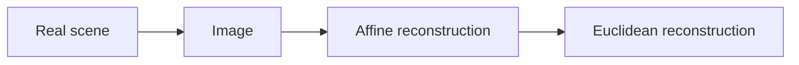

# iacv
Repository for the homework of Image Analysis and Computer Vision course of Politecnico di Milano 2017/2018.  

## Shape reconstruction

Here we used a stratified approach to shape reconstruction.

The final result should be an image such that the transformation between the real scene and the image is a similarity.

### Affine rectification

In order to perform affine rectification we require that the line at infinite in the image is mapped back to itself.

So we first perform the identification of the imaged line at infinite through LSA using 10 couples of imaged parallel lines. 

Once found the image of the line at infinite the reconstruction matrix that rectifies the image is simply:
$$
\begin{vmatrix} 
1& 0 & 0 \\
0 &  1 & 0 \\
l1 &  l2 & l3 \\
\end{vmatrix}
$$
So the last row is the imaged line at infinite.

[pag 49 Multiple View Geometry in computer vision]

### Metric rectification

Once the image has been affinely rectified we have obtained an image such that the transformation from the original scene is an affine transformation.

Affine transformation can be written as:
$$
H_a = \begin{vmatrix} 

a_{11}& a_{1,2} & t_1 \\

a_{2,1} &  a_{2,2} & t_2 \\

0 &  0 & 1 \

\end{vmatrix}
$$

Where the matrix A is a rotation matrix with a scaling component. 

So The image of the dual conic corresponding to circular points can be obtained as:
$$
C^*_{inf}{'} = H_a C^*_{inf} H_a^t  \\
C^*_{inf}{'} = \begin{vmatrix} 
a_{11}^{2} & a_{12}*a_{21} & 0 \\
 a_{12}*a_{21} &  a_{22}^{2}  & 0 \\
0 &  0 & 0 \\
\end{vmatrix}
$$
Notice that the Upper left part is a symmetric matrix and homogeneous, so it has only 2 DOF.

So we can use two pair of orthogonal lines to determine its parameters. 

Once found $$C^*_{inf}{'}$$ we can use standard cholesky (or SVD) to determine Ha.

### Measure of Metric properties

Once we have reconstructed the shape of the object metric properties can be determined, like angles.

The relative orientation between vertical faces can be determined using the cosine between the two lines representing the longest line.

The relative position can be determined simply by computing the difference between the origin of the two reference frames and multiplying by the scaling factor. 

## Camera Calibration

Camera calibration is determining the matrix K:

$$P=[KR | -KRo]$$

Where R is the Rotation between the camera and the world and o is the location of the camera wrt the world reference frame.

In order to determine K we need to specify some constraints on $$\omega$$ (the image of the absolute conic).

Here we can use the homography method (p 211 Multiple View Geometry in Computer Vision) adapted with the reconstructive transformation (that we have found in the previous point) on the horizontal faces.

1. For each horizontal face we can compute the transformation that maps its corner points to their imaged points ($$H_r^{-1}$$ since $$H_r$$ maps the image point to their real shape).

2. We can compute the imaged circular points for the plane of that face as $$H_r(1,\pm i, 0)'$$. Writing H = [h1, h2, h3], the imaged circular points are h1 +- ih2.

3. This gives us two constraints on the image of the absolute conic since the circular points lie on $$\omega$$:
   $$
   h_1^T\omega h_2= 0\\ h_1^T\omega h_1= h_2^T\omega h_2
   $$
   Which are linear equations in $$\omega$$.

Other constraints that can be used are the constraints deriving from the fact that the line at infinite on the orizontal plane is orthogonal wrt the vanishing points on the vertical direction on the vertical face:
$$
l_{inf}^T\omega v_p = 0
$$
In order to determine the vanishing point of the vertical direction we can use a least square approximation using all vertical lines on the vertical face.

## Localization

In this point we have to find the relative position of the camera wrt the reference frame placed on the horizontal faces.

This is possibe knowing the shape of the horizontal faces, knowing the size, knowing the image and knowing K.

The main formula is:

$$[i, j, o] = K^{-1}H$$

Where H is the transformation mapping world points to image point. In this case it's $$H_r^{-1} * H_{omog}^{-1}$$.

$$H_{omog}$$ it's easy to find since knowing the rectified image we should only impose it's real measure.

$$H_{omog}$$ transforms the rectified image in the real world scene.

